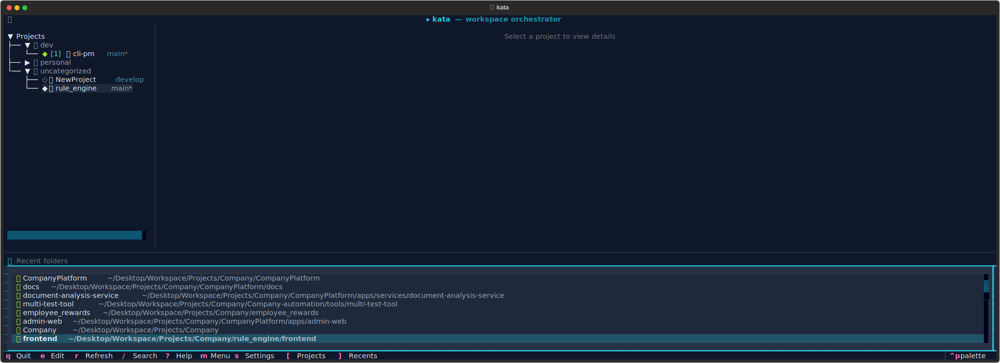
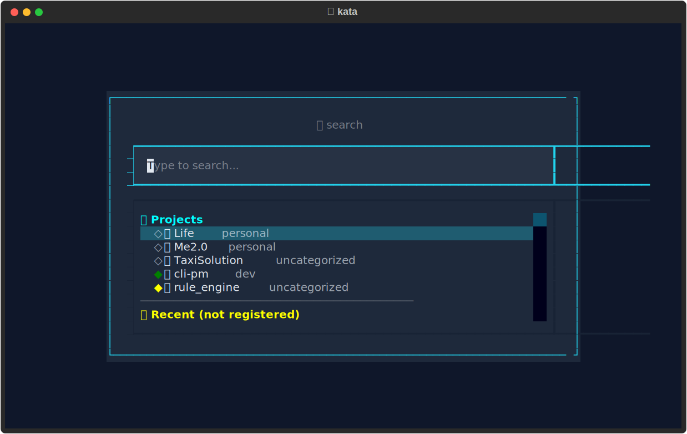
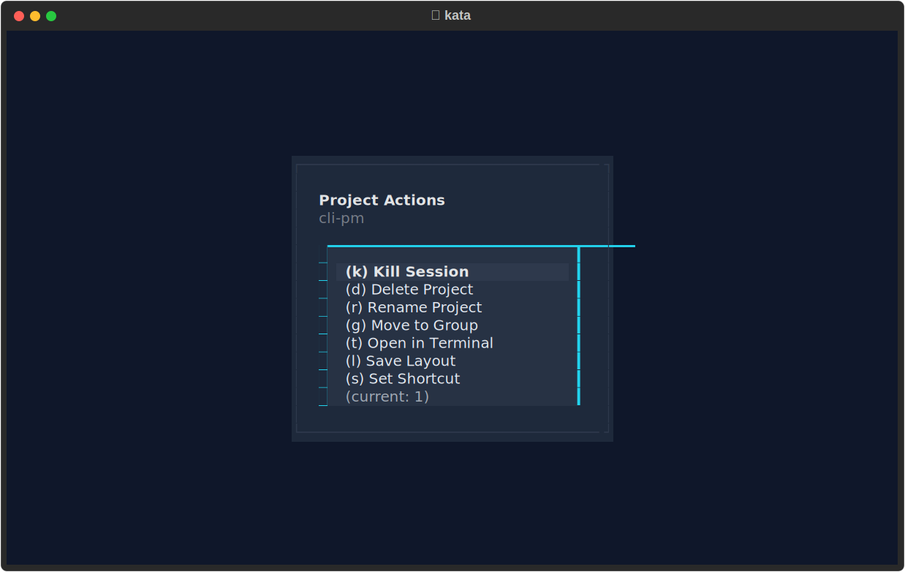
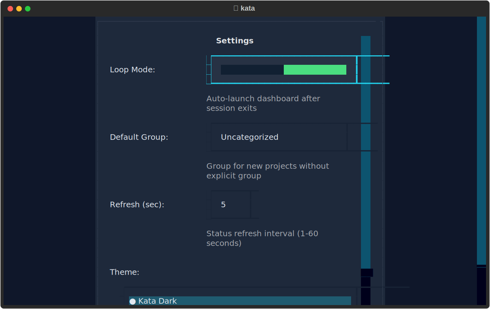

# Kata

**Terminal-centric workspace orchestrator for tmux**

Kata is a powerful CLI and TUI tool that transforms how you manage development workspaces. It combines the speed of tmux with intelligent project organization, giving you instant access to any project with a single keystroke.


<p align="center">
  
</p>

---

## Why Kata?

**The Problem:** Developers juggle multiple projects daily. Each context switch involves:
- Navigating to the project directory
- Activating virtual environments
- Opening editors and terminals
- Remembering where you left off

**The Solution:** Kata eliminates this friction:
- **One keystroke** to switch between any project (`Ctrl+Space`)
- **Persistent sessions** that survive terminal closures
- **Smart templates** that auto-configure your workspace
- **Beautiful TUI** for visual project management

---

## Features at a Glance

| Feature | Description |
|---------|-------------|
| **Instant Switching** | Press `Ctrl+Space` anywhere to fuzzy-search and switch projects |
| **Session Persistence** | Tmux sessions survive terminal crashes and reboots |
| **Auto-Detection** | Automatically detects Python, Node.js, Go projects |
| **Smart Templates** | Pre-configured layouts with editor, shell, and test windows |
| **Layout Saving** | Capture your current tmux layout and save it to the config |
| **Quick Launch** | Assign shortcuts (1-9) for instant project access |
| **Zoxide Integration** | Access frequently visited directories from the recents panel |
| **Morning Routine** | Launch multiple projects with one command |
| **Git Integration** | See branch, dirty state, and upstream status at a glance |
| **Return Loop** | Dashboard auto-relaunches after detaching from sessions |
| **Beautiful TUI** | Interactive dashboard with search, preview, and custom themes |

---

## Installation

### Quick Install via PyPI (Recommended)

**Prerequisites:** Python 3.10+, tmux, fzf, tmuxp, zoxide (optional)

```bash
# macOS - install prerequisites
brew install python@3.11 tmux fzf zoxide
pip install tmuxp

# Ubuntu/Debian - install prerequisites
sudo apt install python3.10 tmux fzf
pip install tmuxp
# zoxide: curl -sS https://raw.githubusercontent.com/ajeetdsouza/zoxide/main/install.sh | bash
```

```bash
# Install kata (with pipx - recommended)
pipx install kata-workspace --python python3.11

# Or with pip
pip install kata-workspace
```

**Configure tmux keybinding** (Ctrl+Space for project switching):

```bash
# Add to ~/.tmux.conf
echo 'bind-key -n C-Space display-popup -E -w 80% -h 70% "kata switch"' >> ~/.tmux.conf

# Reload tmux config
tmux source ~/.tmux.conf
```

**Set your editor** (add to `~/.zshrc` or `~/.bashrc`):

```bash
export EDITOR=nvim   # or: vim, code, nano
```

> **Note:** `$EDITOR` is used in default layouts to open your editor window and for `kata edit`.

Now run `kata` to launch the dashboard!

### Install from Source

```bash
# Clone and run the install script
git clone https://github.com/kata-workspace/kata.git
cd kata
./scripts/install.sh
```

The install script will:
- Check Python version (requires 3.10+)
- Check and install prerequisites (tmux, fzf, tmuxp)
- Install Kata via pipx/uv/pip (in that order of preference)
- Configure tmux keybindings (Ctrl+Space for switching)
- Optionally enable return loop

### Manual Installation

#### Prerequisites

- **Python 3.10+** (required)
- **tmux** (terminal multiplexer)
- **tmuxp** (tmux session manager)
- **fzf** (fuzzy finder) - for project switching
- **zoxide** (optional) - for recents/frecency features

```bash
# macOS
brew install python@3.11 tmux fzf zoxide
pip install tmuxp

# Ubuntu/Debian
sudo apt install python3.10 tmux fzf
curl -sS https://raw.githubusercontent.com/ajeetdsouza/zoxide/main/install.sh | bash
pip install tmuxp
```

#### Install Kata

```bash
# From PyPI (recommended)
pipx install kata-workspace --python python3.11
# Or: pip install kata-workspace

# From source
git clone https://github.com/kata-workspace/kata.git
cd kata
pip install .
```

#### Configure Tmux

Run the setup script to add Ctrl+Space keybinding:

```bash
./scripts/setup-tmux.sh
```

Or manually add to `~/.tmux.conf`:

```bash
# Kata workspace orchestrator
bind-key -n C-Space display-popup -E -w 80% -h 70% "kata switch"
```

Then reload: `tmux source ~/.tmux.conf`

#### Shell Configuration

Add to your shell profile (`~/.zshrc` or `~/.bashrc`):

```bash
# Set your preferred editor (required for kata edit command)
export EDITOR=nvim   # or: vim, code, nano, etc.

# Alternative: use VISUAL for GUI editors
export VISUAL=code   # VS Code, Sublime, etc.
```

**Note:** Kata uses `$EDITOR` (or `$VISUAL`) for the `kata edit` command. If neither is set, it falls back to `nano` → `vim` → `vi`.

### Available Scripts

| Script | Description |
|--------|-------------|
| `scripts/install.sh` | Full installation with dependency checks, tmux config, and setup |
| `scripts/setup-tmux.sh` | Configure only tmux keybindings (for existing installations) |

#### install.sh

The main installation script that handles everything:

```bash
./scripts/install.sh
```

**What it does:**
- Detects your OS (macOS/Linux)
- Checks for required dependencies (python3, tmux, fzf, tmuxp)
- Checks for optional dependencies (zoxide)
- Offers to install missing dependencies via Homebrew (macOS)
- Installs Kata in development mode
- Configures tmux with Ctrl+Space keybinding
- Optionally enables the return loop feature

#### setup-tmux.sh

Standalone script to configure tmux keybindings:

```bash
./scripts/setup-tmux.sh
```

**What it does:**
- Adds `Ctrl+Space` keybinding for project switching
- Creates a backup of your existing `~/.tmux.conf`
- Skips if already configured

---

## Quick Start

### 1. Add Your First Project

```bash
# Add current directory
kata add

# Add with a group
kata add ~/projects/my-app --group Work

# Scan and import multiple projects
kata scan ~/projects --depth 2
```

### 2. Launch the Dashboard

```bash
kata
```

This opens the interactive TUI where you can browse, search, and launch projects.

### 3. Launch a Project

```bash
# From CLI
kata launch my-app

# From TUI: select project and press Enter
```

### 4. Switch Between Projects

Once inside a tmux session, press `Ctrl+Space` to open the project switcher. Fuzzy-search your projects and hit Enter to switch instantly.

### 5. Return to Dashboard

Press `Prefix + d` (standard tmux detach) to leave the current session. If **loop mode** is enabled, you'll automatically return to the Kata dashboard. Otherwise, you'll return to your terminal.

```bash
# Enable loop mode for automatic return to dashboard
kata loop enable
```

---

## CLI Commands

### Project Management

#### `kata add [PATH] [--group GROUP]`
Register a new project with Kata.

```bash
kata add                          # Add current directory
kata add ~/projects/api           # Add specific path
kata add . --group "Work"         # Add with group
kata add . -g "Personal"          # Short form
```

**Features:**
- Auto-detects project type (Python/Node/Go/Generic)
- Generates tmuxp YAML configuration
- Handles name collisions with automatic suffixes
- Validates paths and checks for duplicates

#### `kata list [--group GROUP]`
Display all registered projects.

```bash
kata list                         # All projects
kata list --group Work            # Filter by group
kata list -g Personal             # Short form
```

**Output includes:**
- Session status (● Active, ● Detached, ● Idle)
- Project name, group, and path
- Color-coded table format

#### `kata remove NAME [--force]`
Remove a project from Kata.

```bash
kata remove old-project           # With confirmation
kata remove old-project --force   # Skip confirmation
kata remove old-project -f        # Short form
```

#### `kata move NAME GROUP`
Move a project to a different group.

```bash
kata move my-app "Archive"
```

#### `kata scan [PATH] [--depth N] [--group GROUP] [--yes]`
Recursively discover and import projects.

```bash
kata scan                         # Scan current directory
kata scan ~/code --depth 3        # Scan with depth
kata scan ~/work -g "Work" -y     # Auto-import all
```

**Detection markers:**
- `.git` directory
- `pyproject.toml`, `setup.py`, `requirements.txt` (Python)
- `package.json` (Node.js)
- `go.mod` (Go)

### Session Management

#### `kata launch NAME`
Launch or attach to a project's tmux session.

```bash
kata launch my-app
```

**Behavior:**
- Creates session from YAML config if not running
- Attaches to existing session if already running
- Records access statistics (times opened, last opened)

#### `kata kill [NAME] [--all] [--force]`
Terminate tmux sessions.

```bash
kata kill my-app                  # Kill specific session
kata kill --all                   # Kill all Kata sessions
kata kill -a -f                   # Kill all without confirmation
```

#### `kata switch`
Interactive project switcher using fzf.

```bash
kata switch
```

**Keybinding:** `Ctrl+Space` (auto-configured in Kata sessions)

### Configuration

#### `kata edit NAME`
Open a project's tmuxp config in your editor.

```bash
kata edit my-app
```

Uses `$EDITOR` or `$VISUAL`, falls back to nano/vim/vi.

#### `kata routine [ACTION] [TARGET] [--project]`
Manage the morning routine (batch session launch).

```bash
kata routine                      # Run the routine
kata routine add Work             # Add group to routine
kata routine add my-app -p        # Add specific project
kata routine remove Work          # Remove from routine
kata routine list                 # Show configuration
kata routine clear                # Clear all settings
```

#### `kata loop [ACTION]`
Configure return loop behavior.

```bash
kata loop                         # Show status
kata loop enable                  # Enable return loop
kata loop disable                 # Disable return loop
```

When enabled, the dashboard re-launches after you detach from any session.

#### `kata migrate`
Migrate configs from legacy central location to project folders.

```bash
kata migrate
```

This moves config files from `~/.config/kata/configs/` to each project's folder as `.kata.yaml`. Migration also happens automatically when launching a session.

---

## TUI Dashboard

Launch with `kata` (no arguments).

### Layout

```
┌─────────────────────────────────────────────────────────────┐
│  ▸ kata | workspace orchestrator                            │
├─────────────────────────┬───────────────────────────────────┤
│                         │                                   │
│  ▼ Work                 │  my-app                           │
│    󰌠 my-app       ●     │                                   │
│    󰎙 frontend     ●     │  Path:   ~/projects/my-app        │
│                         │  Type:   Python 󰌠                 │
│  ▼ Personal             │  Status: Active                   │
│    󰉋 dotfiles     ●     │  Branch: main*                    │
│                         │                                   │
│                         │  ┌─────┬─────┬─────┐              │
│                         │  │edit │shell│tests│              │
│                         │  └─────┴─────┴─────┘              │
│                         │                                   │
│                         │  Opened: 42 times                 │
│                         │  Last:   2024-01-15 14:30         │
│                         │                                   │
├─────────────────────────┴───────────────────────────────────┤
│  [Enter] Launch  [a] Add  [e] Edit  [/] Search  [?] Help    │
└─────────────────────────────────────────────────────────────┘
```

### Keyboard Shortcuts

| Key | Action |
|-----|--------|
| `Enter` | Launch selected project |
| `1-9` | Quick launch project with that shortcut |
| `a` | Add new project |
| `e` | Edit project config |
| `m` | Open context menu |
| `s` | Open settings |
| `/` | Toggle search |
| `Tab` | Switch between projects and recents |
| `[` | Focus projects panel |
| `]` | Focus recents panel |
| `Escape` | Cancel/close |
| `?` | Show help |
| `k` | Quick kill session |
| `d` | Quick delete project |
| `r` | Refresh status |
| `q` | Quit dashboard |

### Search

Press `/` to activate search. Type to fuzzy-filter projects by name or group. Press `Escape` to clear and close search.

<p align="center">
  
</p>

### Context Menu

Press `m` on any project to access:
- **Kill Session** (`k`) - Terminate the tmux session
- **Delete Project** (`d`) - Remove from registry
- **Rename Project** (`r`) - Change the project name
- **Move to Group** (`g`) - Change group assignment
- **Open in Terminal** (`t`) - Open directory in new terminal
- **Save Layout** (`l`) - Capture current tmux layout to config
- **Set Shortcut** (`s`) - Assign a quick-launch number (1-9)

<p align="center">
  
</p>

### Settings

Press `s` to configure:
- **Return Loop** - Auto-relaunch dashboard after detach
- **Default Group** - Group for new projects
- **Refresh Interval** - Status update frequency (1-60 seconds)
- **Theme** - Visual theme (kata-dark, kata-light, kata-ocean, kata-warm)

<p align="center">
  
</p>

---

## Tmux Session Keybindings

When inside a Kata-managed tmux session:

| Key | Action |
|-----|--------|
| `Prefix + d` | Detach from session (returns to dashboard if loop mode enabled) |
| `Ctrl+Space` | Open project switcher (fzf popup) |

`Prefix + d` is the standard tmux detach. `Ctrl+Space` is automatically configured when sessions are created.

---

## Layout Saving

Kata can capture your current tmux session layout and save it to the project's config file. This is useful when you've customized your window arrangement and want to preserve it.

### How to Save Layout

1. Arrange your tmux windows and panes as desired
2. Open the context menu (`m` in TUI)
3. Select **Save Layout** (`l`)

The current layout is captured including:
- Window names and positions
- Pane arrangements
- Running commands (e.g., `nvim`, `npm run dev`)
- Working directories

The saved layout will be used next time you launch the project.

---

## Quick Launch Shortcuts

Assign number shortcuts (1-9) to your most-used projects for instant access.

### Setting a Shortcut

1. Select a project in the TUI
2. Open context menu (`m`)
3. Choose **Set Shortcut** (`s`)
4. Enter a number 1-9

### Using Shortcuts

Press the number key directly in the dashboard to instantly launch that project:
- `1` - Launch project with shortcut 1
- `2` - Launch project with shortcut 2
- ... and so on up to `9`

Projects with shortcuts show their number in the tree view.

---

## Zoxide Integration

Kata integrates with [zoxide](https://github.com/ajeetdsouza/zoxide) to show your frequently visited directories in the **Recents** panel at the bottom of the dashboard.

### Features

- Directories are sorted by frecency (frequency + recency)
- Quickly launch adhoc sessions for unregistered directories
- Press `a` on a recent to add it as a registered project
- Use `Tab` or `]` to focus the recents panel

### Adhoc Sessions

When you launch a directory from recents that isn't a registered project, Kata creates an **adhoc session** with:
- Auto-detected project type
- Standard layout (editor + shell + tests)
- Temporary config (not persisted)

To make it permanent, press `a` to add it as a registered project.

---

## Layout Presets

When adding a project, Kata generates a tmuxp YAML configuration. Choose from these presets:

### Minimal
Single editor window.
```
┌──────────────┐
│    editor    │
└──────────────┘
```

### Standard (Default)
Editor, shell, and tests windows.
```
┌──────────────┬──────────────┬──────────────┐
│    editor    │    shell     │    tests     │
└──────────────┴──────────────┴──────────────┘
```
- Python: Auto-activates virtualenv
- Node: Ready for `npm run dev`
- Go: Ready for `go test`

### Full
Comprehensive setup with split panes.
```
┌──────────────┬──────────────┬──────────────┬──────────────┬──────────────┐
│    editor    │    shell     │    tests     │    build     │    logs      │
│   (split)    │              │              │              │   (split)    │
└──────────────┴──────────────┴──────────────┴──────────────┴──────────────┘
```

### Custom
Starts minimal, edit the YAML yourself:
```bash
kata edit my-project
```

---

## Project Types

Kata auto-detects project types and configures templates accordingly:

| Type | Detection Markers | Template Features |
|------|-------------------|-------------------|
| **Python** | `pyproject.toml`, `setup.py`, `requirements.txt`, `Pipfile` | Virtualenv activation, pytest |
| **Node.js** | `package.json` | npm scripts ready |
| **Go** | `go.mod` | go test, go build |
| **Generic** | Any other | Basic editor setup |

---

## Git Integration

The TUI preview pane shows:
- **Current branch** - e.g., `main`, `feature/auth`
- **Dirty indicator** - `*` when uncommitted changes exist
- **Upstream status** - `↑2` ahead, `↓3` behind

Example: `main* ↑2 ↓1` means you're on main with uncommitted changes, 2 commits ahead, and 1 behind upstream.

---

## Morning Routine

Launch multiple projects at once for your daily workflow:

```bash
# Set up your routine
kata routine add Work              # Add all "Work" projects
kata routine add important-app -p  # Add specific project
kata routine list                  # Review configuration

# Every morning
kata routine                       # Launch everything
```

Output:
```
Starting morning routine (5 projects)...

  ✓ api-server
  ✓ frontend
  ⏭ database (already running)
  ✓ docs
  ✗ legacy-app: Config not found

Done! Launched: 3, Skipped: 1, Failed: 1
```

---

## Configuration Files

Kata stores global configuration in `~/.config/kata/` and project configs in each project folder:

```
~/.config/kata/
├── registry.json      # Project registry
├── settings.json      # App settings
├── routine.json       # Morning routine config
└── tree_state.json    # TUI tree expansion state

~/projects/my-app/
└── .kata.yaml         # tmuxp config for this project
```

Each project's tmux configuration is stored as `.kata.yaml` in the project directory itself, making it easy to version control with the project.

### registry.json
```json
{
  "version": "1.0",
  "projects": [
    {
      "name": "my-app",
      "path": "/home/user/projects/my-app",
      "group": "Work",
      "config": "my-app.yaml",
      "created_at": "2024-01-15T10:30:00",
      "last_opened": "2024-01-20T14:45:00",
      "times_opened": 42
    }
  ]
}
```

### settings.json
```json
{
  "loop_enabled": true,
  "default_group": "Uncategorized",
  "refresh_interval": 5,
  "theme": "kata-dark"
}
```

---

## Themes

Available themes for the TUI:

| Theme | Description |
|-------|-------------|
| `kata-dark` | Dark theme with cyan/violet accents (default) |
| `kata-light` | Light background with warm accents |
| `kata-ocean` | Deep ocean blue palette |
| `kata-warm` | Cozy warm tones with amber highlights |
| `kata-glass` | Frosted glass aesthetic - muted dark blue-gray |
| `kata-glass-light` | Light frosted glass - soft whites and silvers |

Change theme in settings (`s` in TUI) or:
```bash
# Edit settings directly
$EDITOR ~/.config/kata/settings.json
```

---

## Tips & Best Practices

### Organize with Groups
```bash
kata add ~/work/api -g "Work"
kata add ~/work/frontend -g "Work"
kata add ~/personal/blog -g "Personal"
kata add ~/archived/old-app -g "Archive"
```

### Use the Morning Routine
```bash
kata routine add Work
kata routine add important-project -p
# Now just run `kata routine` each morning
```

### Enable Return Loop
```bash
kata loop enable
```
Now detaching (`Prefix + d`) takes you back to the dashboard instead of the bare terminal.

### Fast Project Switching
Inside any Kata session, press `Ctrl+Space` for instant fuzzy search across all projects.

### Customize Templates
```bash
kata edit my-project
```
Modify window names, add panes, change shell commands, etc.

### Scan Multiple Directories
```bash
kata scan ~/work -g "Work" -y
kata scan ~/personal -g "Personal" -y
```

---

## Troubleshooting

### "fzf not found"
```bash
# macOS
brew install fzf

# Ubuntu
sudo apt install fzf
```

### "tmuxp not found"
```bash
pip install tmuxp
# Or
uv tool install tmuxp
```

### "kata not in PATH"
```bash
# If installed with uv
uv tool install -e /path/to/kata

# Or add to PATH
export PATH="$HOME/.local/bin:$PATH"
```

### Session not switching in popup
The `kata-switch` script handles this. Ensure it's in your PATH:
```bash
which kata-switch  # Should show ~/.local/bin/kata-switch
```

### Projects not appearing
```bash
kata list  # Check if registered
kata scan ~/projects  # Re-scan if needed
```

---

## Architecture

```
kata/
├── cli/
│   └── app.py           # CLI commands (Typer)
├── tui/
│   ├── app.py           # Dashboard application (Textual)
│   ├── widgets/         # UI components
│   │   ├── tree.py      # Project tree widget
│   │   ├── preview.py   # Preview pane widget
│   │   └── search.py    # Search input widget
│   └── screens/         # Modal screens
│       ├── context_menu.py
│       ├── wizard.py    # Add project wizard
│       └── settings.py
├── services/
│   ├── registry.py      # Project storage
│   ├── sessions.py      # Tmux session management
│   ├── routine.py       # Morning routine
│   └── loop.py          # Return loop
├── utils/
│   ├── detection.py     # Project type detection
│   ├── scanner.py       # Directory scanning
│   ├── git.py           # Git integration
│   └── fzf.py           # FZF picker
└── core/
    ├── config.py        # Configuration paths
    ├── settings.py      # Settings management
    ├── models.py        # Data models
    └── templates.py     # tmuxp template generation
```

---

## Dependencies

| Package | Purpose |
|---------|---------|
| `typer` | CLI framework |
| `textual` | TUI framework |
| `rich` | Terminal formatting |
| `libtmux` | Tmux Python API |
| `tmuxp` | Tmux session manager |
| `pyyaml` | YAML configuration |

---

## Contributing

Contributions are welcome! Please:

1. Fork the repository
2. Create a feature branch
3. Make your changes
4. Run tests: `pytest`
5. Submit a pull request

---

## License

MIT License - see [LICENSE](LICENSE) for details.

---

## Acknowledgments

- [tmux](https://github.com/tmux/tmux) - Terminal multiplexer
- [tmuxp](https://github.com/tmux-python/tmuxp) - Tmux session manager
- [Textual](https://github.com/Textualize/textual) - TUI framework
- [fzf](https://github.com/junegunn/fzf) - Fuzzy finder
- [zoxide](https://github.com/ajeetdsouza/zoxide) - Smarter cd command

---

**Happy coding with Kata!** 🥋
