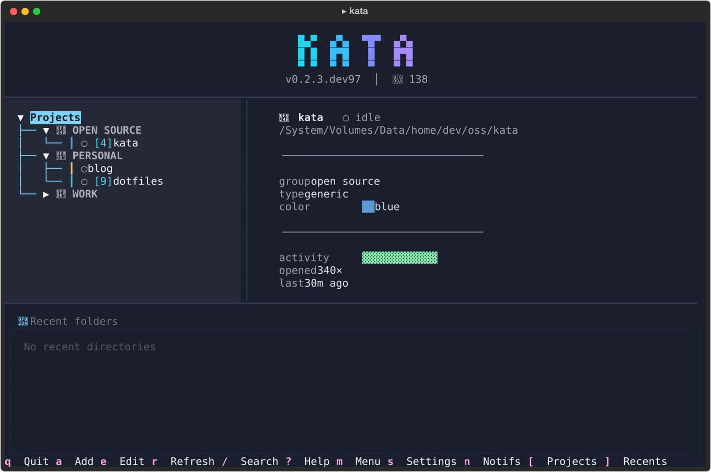
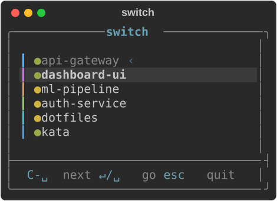
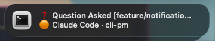
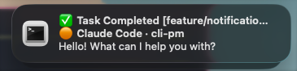
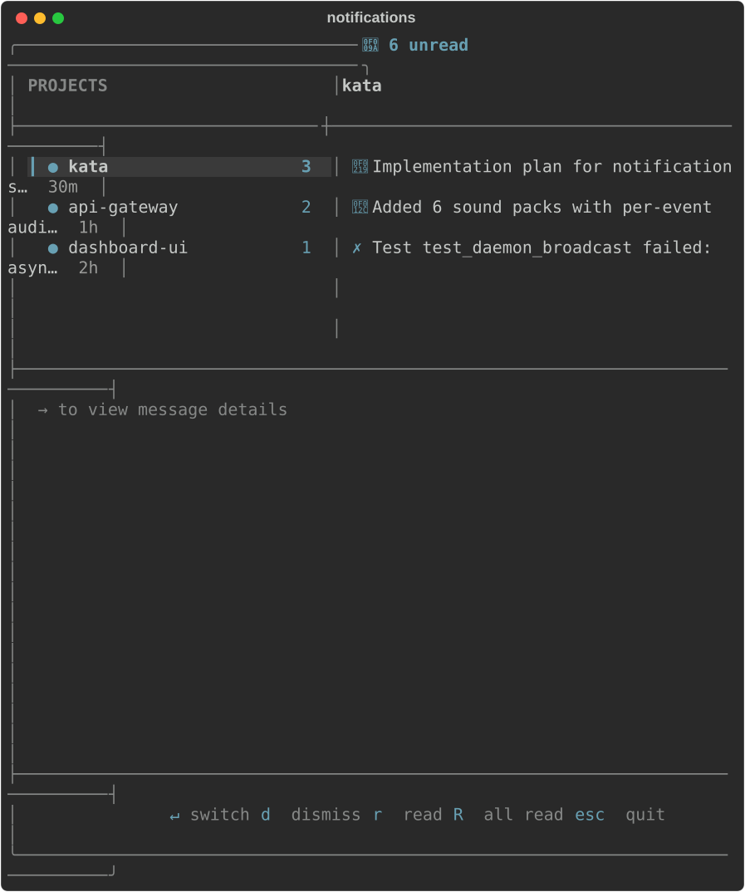
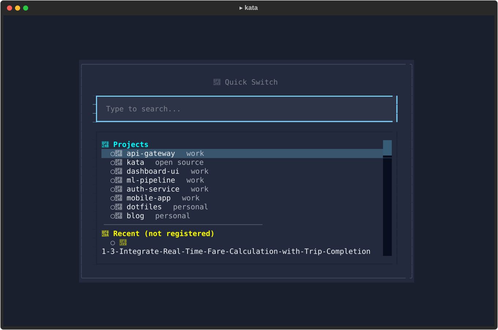
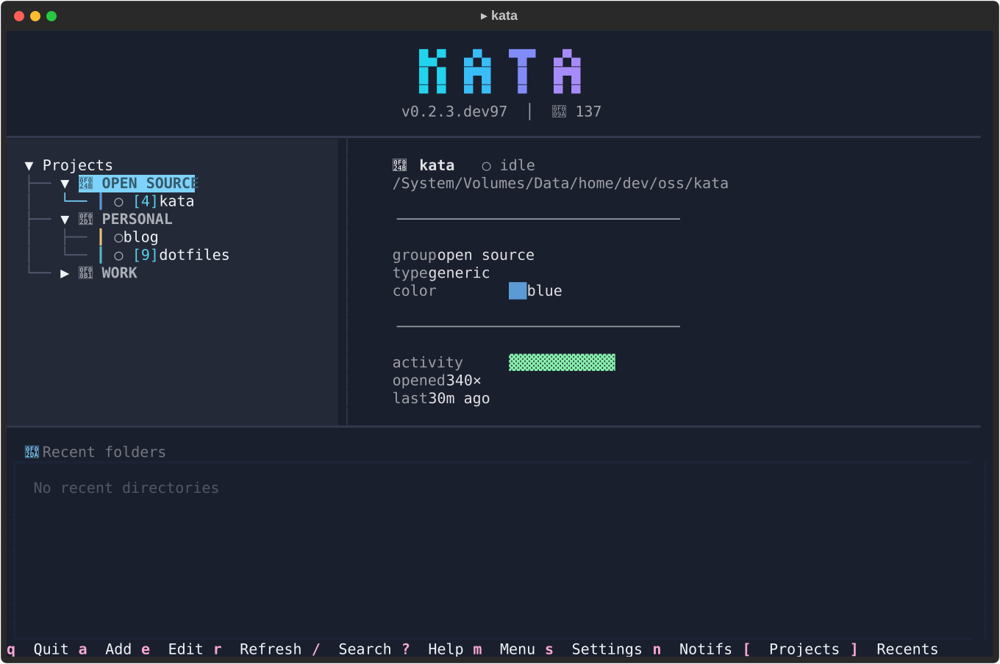
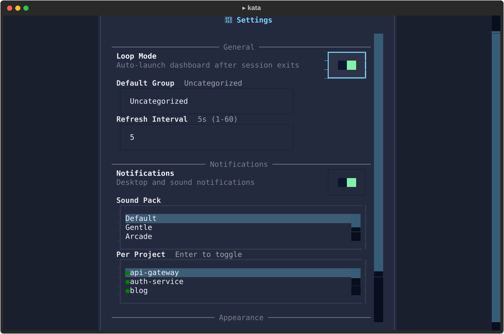
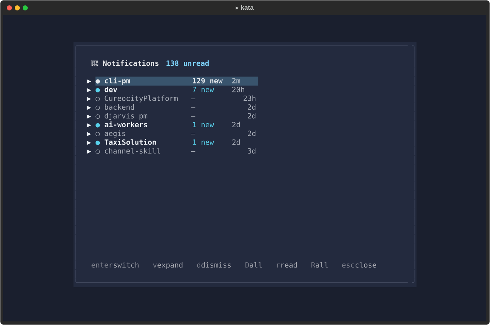

<p align="center">
  
</p>

<p align="center">
  <strong>Instant project switching. AI-aware notifications. Tmux, orchestrated.</strong>
</p>

<p align="center">
  
  
  
</p>

<p align="center">
  
</p>

---

## What Makes Kata Different

### Ctrl+Space — Alt+Tab for Your Terminal

Press `Ctrl+Space` from any tmux session to instantly switch projects. No navigating directories, no re-opening editors, no remembering session names. Your projects are always one keystroke away.

<p align="center">
  
</p>

### AI Notifications Across Projects

Running Claude Code in project A while working in project B? Kata hooks into **Claude Code**, **Gemini CLI**, and **Codex** to notify you the moment a task completes, a question is asked, or an error occurs — with macOS desktop notifications, an in-terminal notification center (`Ctrl+N`), and **6 sound packs** (default, gentle, arcade, arabic, zen, funk) with per-event audio cues. Smart suppression prevents notification spam — deduplication, cooldowns, and per-project toggles.

<p align="center">
  
  &nbsp;&nbsp;
  
</p>

<p align="center">
  
</p>

### Workspaces That Never Die

Every project gets a persistent tmux session with smart layouts (editor + shell + tests). Detach and come back later — everything is exactly where you left it. Enable **return loop** and the dashboard auto-relaunches after every detach, so you're never dumped into a bare shell.

---

## Quick Start

```bash
# Install
pip install kata-workspace   # or: pipx install kata-workspace
brew install tmux fzf        # prerequisites (macOS)

# Add projects
kata add ~/projects/my-app --group Work
kata scan ~/projects --depth 2 -y

# Launch dashboard
kata

# Configure hooks & keybindings
kata setup
```

Press `Enter` on any project to launch it. Press `Ctrl+Space` to switch between active sessions.

---

## Features

| | Feature | Description |
|---|---------|-------------|
| **Switch** | `Ctrl+Space` switcher | Popup project switcher from any tmux session |
| **Notify** | AI tool hooks | Claude Code, Gemini CLI, Codex task completion alerts |
| **Notify** | Notification center | `Ctrl+N` popup with per-project notification grouping |
| **Notify** | Sound + macOS alerts | 6 sound packs (default, gentle, arcade, arabic, zen, funk) + native desktop notifications |
| **TUI** | Interactive dashboard | Browse, search, and launch projects with keyboard |
| **TUI** | 10 themes | kata-dark, kata-ocean, kata-warm, kata-glass, and more |
| **TUI** | Project colors | 12 color presets + hex codes — accents in tmux status bar and project tree |
| **Session** | Persistent sessions | Tmux sessions survive terminal closures |
| **Session** | Return loop | Dashboard auto-relaunches after detach |
| **Session** | Morning routine | `kata routine` launches all your daily projects at once |
| **Session** | Layout capture | Save your current tmux pane arrangement to config |
| **Project** | Auto-detection | Detects Python, Node.js, Go projects automatically |
| **Project** | Smart templates | Pre-configured layouts with virtualenv, test runners |
| **Project** | Quick shortcuts | Assign `1`-`9` keys for instant project launch from dashboard |
| **Project** | Zoxide recents | Frecency-sorted recent directories with adhoc sessions |
| **Project** | Git integration | Branch, dirty state, upstream status at a glance |
| **Ops** | `kata setup` | Interactive setup for hooks, keybindings, tools |
| **Ops** | `kata uninstall` | Clean removal of all hooks, configs, and the package |

### Project Colors

Assign colors to projects for instant visual identification. Colors appear as an accent line in the tmux status bar and next to the project name in the tree.

**12 presets:** blue, red, green, orange, purple, teal, rose, amber, cyan, lime, coral, slate — or any `#hex` code.

Set via context menu (`m` → Set Color) in the dashboard.

### Quick Launch Shortcuts

Assign number keys `1`-`9` to your most-used projects. Press the number directly in the dashboard to launch instantly — no scrolling, no searching.

Set via context menu (`m` → Set Shortcut).

### Search, Context Menu & Settings

<p align="center">
  
  
</p>

<p align="center">
  
  
</p>

---

## Commands

| Command | Description |
|---------|-------------|
| `kata` | Launch TUI dashboard |
| `kata add [PATH] [-g GROUP]` | Register a project |
| `kata launch NAME` | Launch/attach to a project session |
| `kata list [-g GROUP]` | List registered projects |
| `kata scan [PATH] [-d N] [-y]` | Discover and import projects |
| `kata switch` | FZF project switcher |
| `kata kill [NAME] [--all]` | Terminate sessions |
| `kata remove NAME` | Unregister a project |
| `kata move NAME GROUP` | Change project group |
| `kata edit NAME` | Edit project tmuxp config |
| `kata routine [add\|remove\|list]` | Morning routine management |
| `kata loop [enable\|disable]` | Return loop toggle |
| `kata setup` | Interactive hook & keybinding setup |
| `kata uninstall` | Interactive uninstaller |

---

## Documentation

| Document | Description |
|----------|-------------|
| **[Full Guide](docs/guide.md)** | Installation, TUI shortcuts, configuration, themes, troubleshooting |
| **[Architecture](docs/architecture/overview.md)** | System design, data flow, key decisions |

---

## Requirements

- **Python 3.10+**, **tmux**, **fzf**, **tmuxp**
- Optional: **zoxide** (recents), **terminal-notifier** (macOS notifications)

---

## License

MIT License - see [LICENSE](LICENSE) for details.
